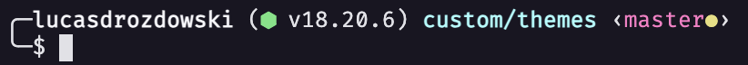

# Lodash theme

Install firacode font-fammily and don't forget to enable on 
your code editor or terminal otherwise the node gliph will not work properly

[firacode Github](https://github.com/tonsky/FiraCode?tab=readme-ov-file)

clone the project, copy to your zsh themes folder, by default:

> cp ~/lodash-zsh-theme/lodash.zsh-theme $ZSH_CUSTOM/themes/lodash.zsh-theme

edit your zsh

> vi ~/.zshrc 

Edit `ZSH_THEME='rubyrussel'` to `ZSH_THEME='lodash'`

> source ~/.zshrc

Done! 🎉

